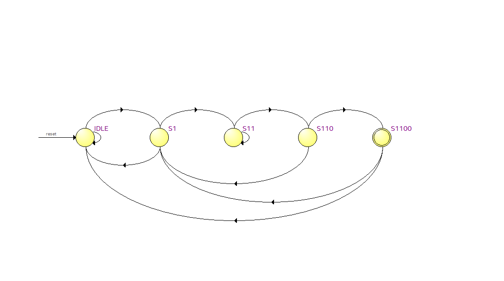

# Verilog-For-Sequence-Dectection

This is the verilog code for Sequence Detection of 1100 pattern Implementation.

  

  <h3 align="center">1100 Sequence Detector</h3>

  

    Welcome to My Github Page!
     This Repo contains the verilog HDL code to implement a 1100 Sequence Detector.
     The above picture is state digram for the logic implemented derived from the state machine viewer.
     Feel free to fork the repo to try and modify the logic to your interest.
     
  Kindly give the project a  star if you find it useful.
    
  

